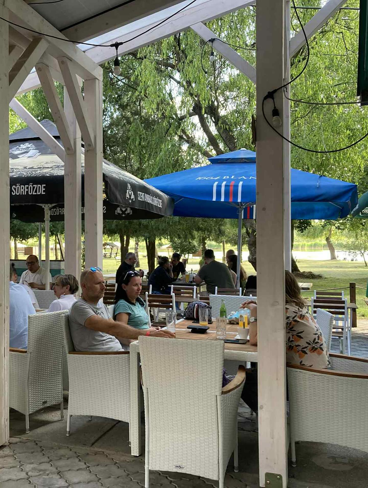
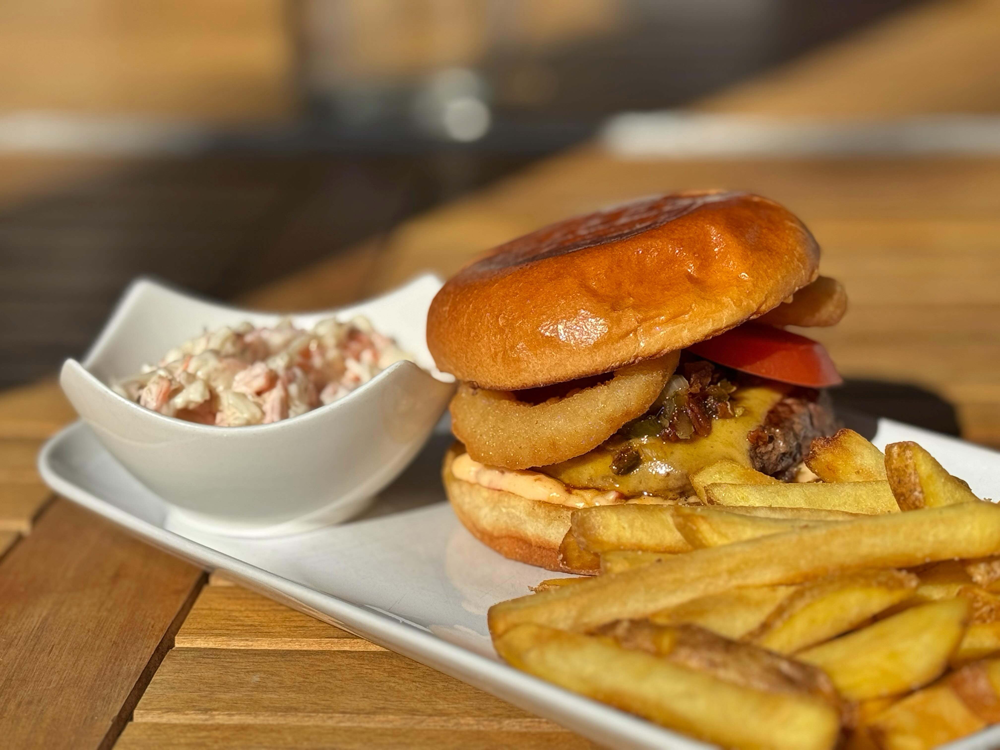
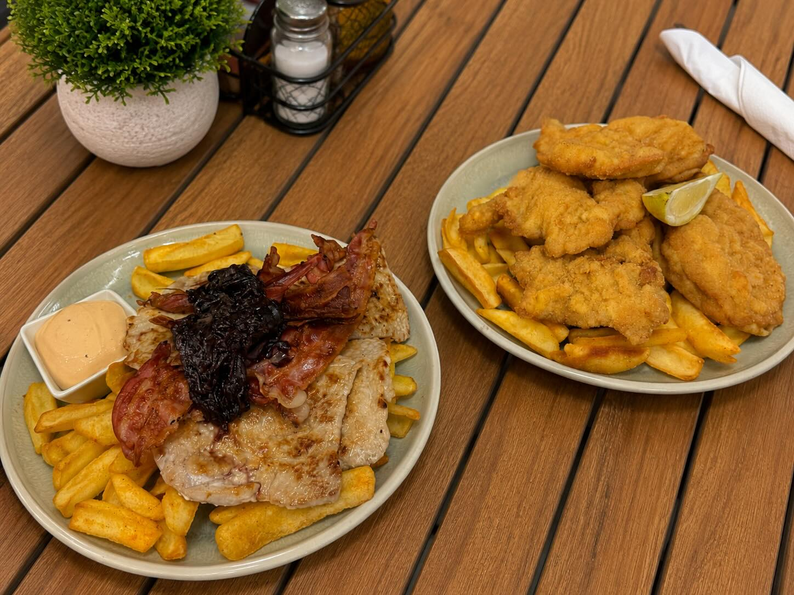
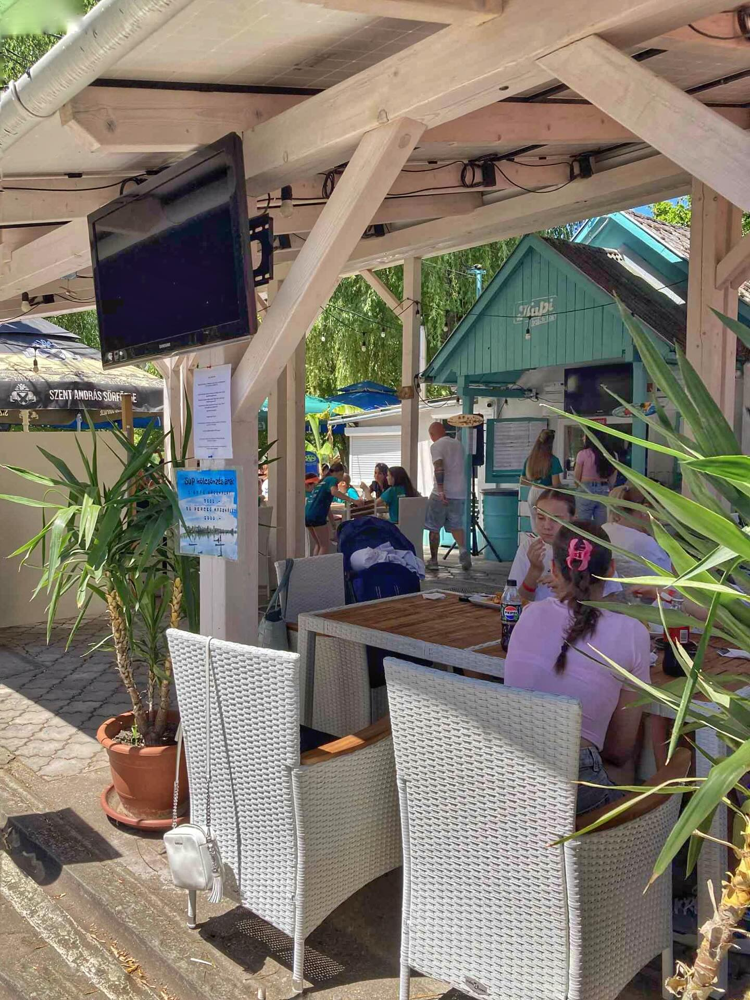

# KuPi Beach Bar — módosító prompt a meglévő weboldalhoz

## Kiindulás

Az alábbiakban megkapod a meglévő KuPi Beach Bar weboldal teljes HTML kódját. Kérlek, módosítsd az alábbi pontok szerint — ne hozz létre új oldalt, hanem a meglévőt fejleszd tovább.

---

## Szükséges módosítások szekciónként

---

### 01 — Navigation

**Jelenlegi állapot:** megvan a logó, a CTA gomb és a hamburger menü.

**Módosítás:** add hozzá a navigációs linkeket a nav-links elembe:
- „Menü" link → `#menu`
- „Megtalálsz minket" link → `#location`
- Ezek a CTA gomb előtt jelenjenek meg

---

### 02 — Hero szekció

**Jelenlegi állapot:** szöveg és placeholder kép van.

**Módosítás:**
- A hero-art placeholder (`.hero-ph`) helyére helyezd el a `kupiBB9.jpg` képet (a türkiz KuPi faház frontálisan). Valódi `` tag, `object-fit: cover`, kerek vagy ívelt vágással (`border-radius: 24px` vagy `clip-path: circle` / erős lekerekítés).
- A hero hátterén legyen látható faléc textúra — CSS `repeating-linear-gradient`-tel szimuláld a vízszintes fadeszkákat: fehér, 8–10% opacitású csíkok, ~50px ismétlődéssel, a `#34ccd7` türkiz alapon.

---

### 04 — Három erősség

**Jelenlegi állapot:** „Három dolog, amit komolyan veszünk" fejléccel jelenik meg.

**Módosítás:** a szekciócímet változtasd erre (pontosan):
> **Frissen. Helyileg. A víz mellett.**

Ez jobban illeszkedik a prémium, tömör kommunikációhoz.

---

### 05 — Célcsoport szekció (Audience)

**Jelenlegi állapot:** a három kártya szöveges placeholderekkel van.

**Módosítás:** minden kártyán a szöveges placeholder helyére kerüljön egy valódi kép a tetején (kis kártyakép, ~200px magas, `object-fit: cover`, lekerekített felső sarokkal):

- **Familia kártya** → `kupiBB3.jpg` (terasz gyerekekkel)
- **Üdülő kártya** → `kupiBB5.jpg` (terasz tóval a háttérben)
- **Törzsvendég kártya** → `kupiBB9.jpg` (türkiz faház)

---

### 05b — Galéria szekció (ÚJ — beilleszteni az Audience és a Menü szekció közé)

**Jelenleg nincs galéria** — ezt kell hozzáadni.

Illeszd be az `<!-- ============ 05 AUDIENCE ============ -->` szekció utána és a `<!-- ============ 06 MENU ============ -->` előtt.

**HTML struktúra:**
```html
<!-- ============ 05b GALLERY ============ -->
<section class="gallery" data-screen-label="Galéria">
  <div class="wrap">
    <div class="gallery-grid">
      <div class="gallery-main">
        
      </div>
      <div class="gallery-side">
        
        
      </div>
    </div>
  </div>
</section>
```

**CSS a galériához** (add a `<style>` blokkba):
```css
.gallery { padding: 0 0 80px; background: var(--white); }
.gallery-grid {
  display: grid;
  grid-template-columns: 2fr 1fr;
  gap: 12px;
  border-radius: 20px;
  overflow: hidden;
}
.gallery-main img {
  width: 100%; height: 460px;
  object-fit: cover; display: block;
}
.gallery-side {
  display: flex; flex-direction: column; gap: 12px;
}
.gallery-side img {
  width: 100%; flex: 1;
  object-fit: cover; display: block;
  border-radius: 0;
}
@media (max-width: 680px) {
  .gallery-grid { grid-template-columns: 1fr; }
  .gallery-main img { height: 260px; }
  .gallery-side { flex-direction: row; }
  .gallery-side img { height: 160px; }
}
```

---

### 06 — Menü szekció

**Jelenlegi állapot:** hat szöveges kártya van, placeholderekkel a képek helyén.

**Módosítás:** a hat kártyából az első háromra helyezz képeket:

- **1. kártya** (Grillezett pisztráng / Ropogós haltál) → `kupiBB2.jpg`
- **2. kártya** (KuPi burger) → `kupiBB8.jpg`
- **3. kártya** (sliders / wokban sült) → `kupiBB7.jpg`

A placeholder `<div class="ph">` elemek helyére valódi `` tagek kerüljenek, `object-fit: cover`, fix magassággal (pl. `height: 180px`), lekerekített felső sarokkal.

A menü szekció hátterén is legyen faléc textúra — ugyanolyan, mint a hero szekcióban (fehér csíkok, alacsony opacitással, türkiz alapon).

---

### 08 — A KuPi-ról szekció

**Jelenlegi állapot:** van egy szöveges placeholder a kép helyén.

**Módosítás:** a `.about-ph` placeholder helyére kerüljön a `kupiBB4.jpg` kép (külső nézet, fehér pergola, türkiz hordók).

```html

```

---

### 09 — Helyszín szekció

**Jelenlegi állapot:** a Google Maps placeholder üres.

**Módosítás:** a `.map-ph` placeholder helyére kerüljön a `kupiBB5.jpg` kép hangulatfotóként (ugyanolyan stílusban, mint az about képe), amíg a valódi térkép embed nem kerül be. Az `aria-label` legyen: „KuPi Beach Bar — tóparti hangulat".

---

### 10 — Záró CTA szekció

**Jelenlegi állapot:** türkiz háttér, egyszerű szöveg.

**Módosítás:**
- Add hozzá a faléc textúrát itt is (ugyanolyan, mint a hero és a menü szekcióban).
- A szekció hátterébe helyezd el a `kupiBB5.jpg` képet halvány overlay-ként:
  ```css
  .final {
    background-image: url('kupiBB5.jpg');
    background-size: cover;
    background-position: center;
    position: relative;
  }
  .final::before {
    content: '';
    position: absolute;
    inset: 0;
    background: rgba(52, 204, 215, 0.82);
  }
  .final .wrap { position: relative; z-index: 1; }
  ```

---

## Képek összesítő táblázata

Az alábbi képfájlok mind mellékelve vannak — ezek mindegyikét add hozzá a fájlhoz az adott szekciókhoz:

| Fájl | Hol használd |
|---|---|
| `kupiBB9.jpg` | Hero jobboldali kép + Törzsvendég kártya |
| `kupiBB5.jpg` | Galéria főkép + Üdülő kártya + Záró CTA háttér + Helyszín |
| `kupiBB8.jpg` | Hero alt + Galéria oldalsó + Menü 2. kártya |
| `kupiBB7.jpg` | Galéria oldalsó + Menü 3. kártya |
| `kupiBB4.jpg` | Rólunk szekció |
| `kupiBB3.jpg` | Família kártya |
| `kupiBB2.jpg` | Menü 1. kártya |

---

## Faléc textúra — CSS definíció

Ezt a CSS-t add hozzá a `:root` blokk után, és alkalmazd a `.hero`, `.menu`, `.final` szekciókra:

```css
.wood-bg {
  background-color: var(--turq);
  background-image:
    repeating-linear-gradient(
      180deg,
      transparent,
      transparent 46px,
      rgba(255,255,255,0.09) 46px,
      rgba(255,255,255,0.09) 48px
    );
}
```

Majd a HTML-ben add hozzá a `wood-bg` osztályt: `<section class="hero wood-bg">`, `<section class="menu wood-bg">`, `<section class="final wood-bg">`.

---

## Amit NE változtass

- A meglévő szövegek, szlogenek, idézetek pontosan maradjanak
- A betűtípusok (Pacifico + DM Sans) maradjanak
- A színpaletta (`#34ccd7`, `#bbdd1e`, `#0a4a4e`, `#f7f5f0`) ne változzon
- A responsive viselkedés maradjon meg
- A scroll animációk (`.reveal` osztályok) maradjanak

---

## Végeredmény

Az oldal a módosítások után:
- Tartalmaz valódi képeket a KuPi tényleges helyéről és ételeiről
- A türkiz szekciókon látszik a faléc textúra
- Van egy mozaikos galéria szekció az 5. és 6. szekció között
- A kártyák tetején valódi fotók vannak a képekről és a vendégforgalomról
- A záró CTA szekció a valódi hely hangulatát közvetíti
